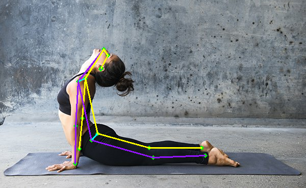

# MoveNet_Yoga
This project identifies and evaluates several yoga movements.

## Related Library

- Python (programming language): <a href="https://www.python.org/downloads/release/python-31010/" alt="Python"></a>

- The PyPA recommended tool for installing Python packages: <a href="https://pypi.org/project/pip/" alt="pip"></a>

- Fundamental package for array computing in Python: <a href="https://numpy.org/" alt="numpy"></a>

- Powerful data structures for data analysis, time series, and statistics: <a href="https://pandas.pydata.org/" alt="pandas"></a>

- Fast, Extensible Progress Meter: <a href="https://tqdm.github.io/" alt="tqdm"></a>

- Pure python download utility: <a href="https://pypi.org/project/wget/" alt="wget"></a>

- Source machine learning framework for everyone: <a href="https://www.tensorflow.org/" alt="tensorflow"></a>

- Python plotting package: <a href="https://matplotlib.org/" alt="matplotlib"></a>

- Wrapper package for OpenCV python bindings: <a href="https://github.com/opencv/opencv-python" alt="opencv-python"></a>

- A set of python modules for machine learning and data mining: <a href="https://scikit-learn.org/stable/" alt="scikit learn"></a>

- Parser for command-line options, arguments and sub-commands: <a href="https://docs.python.org/3/library/argparse.html" alt="argparse"></a>

## Recommended IDE Setup

[VSCode](https://code.visualstudio.com/) + [Python](https://www.python.org/downloads/release/python-31010/)


## Project Setup
 
<details><summary> <b>Create a virtual environment for the project</b> </summary>

Virtual environment `venv`
```sh
python -m venv venv
```
Activate virtual environment:
```sh
venv\Scripts\activate
```
Update to the latest pip version:
```sh
python.exe -m pip install --upgrade pip
```

</details>


<b>- Install the external dependencies needed for the project:</b>
```sh
pip install -r setup.txt
```

## Make data 

Skeleton is extracted like below FIG

<div align="center">
    <a href="./">
        
    </a>
</div>

``` shell
python make_csv.py --source yoga_cg --data data
```

## Training

Make model `.h5` to detect yoga poses 

``` shell
python train.py --train data/train_data.csv --test data/test_data.csv --output models/model_yoga_LSTM.h5 --epochs 200 --batch 64 --patience 20
```

## Inference detection 
Detect several pose of yoga include: chair, cobra, dog, tree, and warrior

``` shell
python test.py --model models/model_yoga_LSTM.h5 --data images/tree3.jpg
```


# Deactivate env

Once you’re done working with this virtual environment, you can deactivate it:
```sh
deactivate
```
